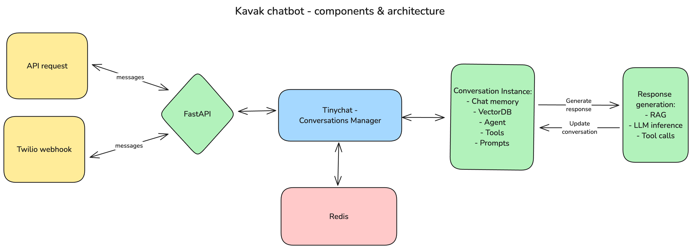
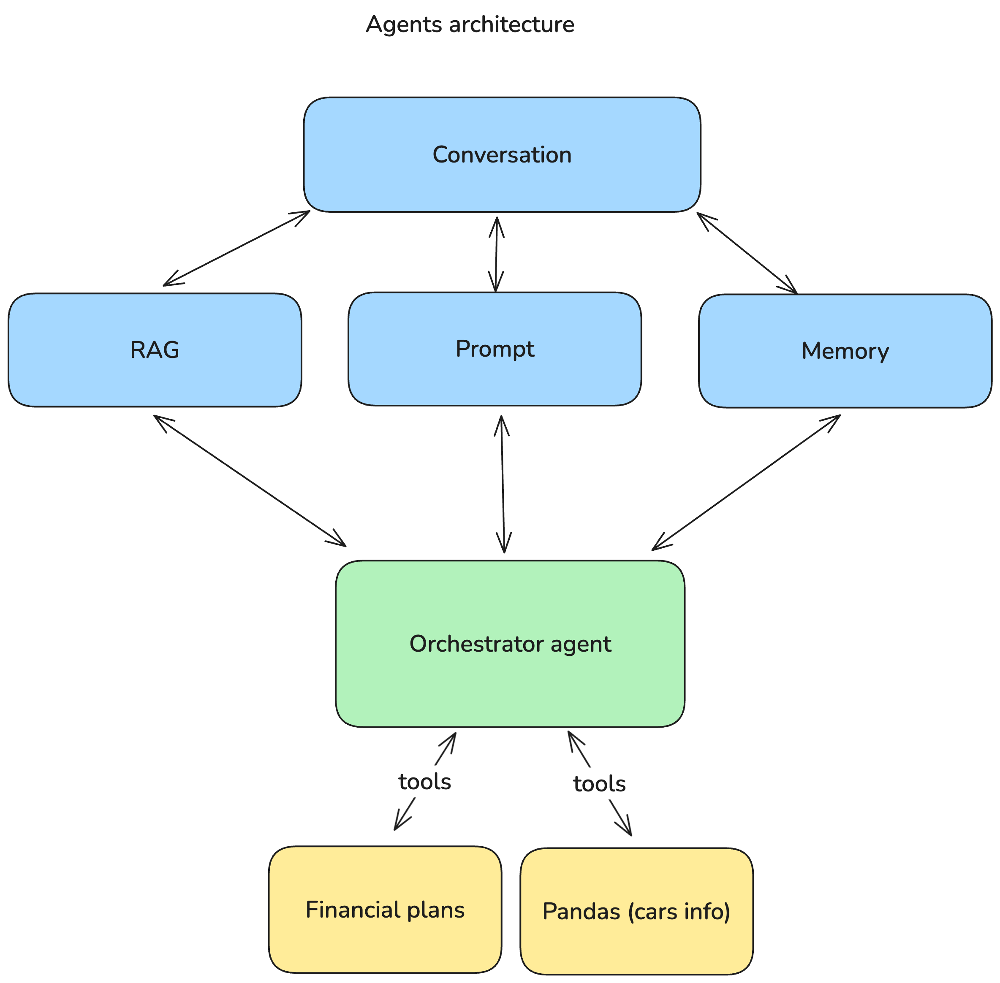

# Kavak AI
A chatbot server built on top of FastAPI and tinychat, built to handle user requests regarding car purchases via API calls and WhatsApp.

# Quickstart
Install ngrok and create a public URL:
```
ngrok http 8081
```

Clone the repository:
```
git clone https://github.com/DanteNoguez/tinychat
```

Instantiate an .env file with your OpenAI and Twilio keys:
```
OPENAI_API_KEY=
TWILIO_ACCOUNT_SID=
TWILIO_AUTH_TOKEN=
```

Lastly, run the app:
```
make kavak-run
```

You can now interact with the chatbot by sending POST requests to the `/chat/send` endpoint of your ngrok URL or by sending WhatsApp messages to the Twilio sandbox number!

# Architecture


At a high level, this server processes incoming requests through a `ConversationsManager`, one of the core abstractions in tinychat. This manager is instantiated with an `AgentRegistry` and a `VectorDBRegistry`, and the configs registered are then used by the manager to instantiate and route `Conversations`. Each conversation has its own state, agent, prompt, tools, and vectordb. All of these components are used in harmony to generate a response, and both the response and the input then update the state of the conversation.
After that, the manager sends back the response to the user and stores the state of the conversation in Redis.



At a more granular level, the `Conversation` holds the memory, prompt, vectorDB, and agent configs. Upon receiving a new message, the conversation prepares the input for the orchestrator agent by performing RAG and putting the message, prompt, and memory together. This is then fed into the agent, which now has enough context to respond and also access to tools that it can use. The financial plans tool is a simple function that is meant to avoid mathematical errors from the LLM; the pandas tool can be considered an agent in itself, and it's an LLM that turns natural language into pandas code, which is then executed after some safety checks to filter or transform a dataframe that holds information about Kavak's catalogue.

## Entry points
- Whatsapp
- API (CRUD for conversations)

## Static default agents
- Main agent (customer support)
    - RAG (Kavak knowledgebase)
    - Car data tool: Pandas agent
    - Financial plans tool

## Unit tests
- Pandas agent accuracy

# Roadmap
- Authentication
- Proxy server (queue, concurrency, token limits and keys management, load balancing)
- Telemetry, performance monitoring, error tracking, costs tracking
- long-term memory, entities memory
- Integrate with internal datasources
- More unit tests, more tools
- Prompt completeness